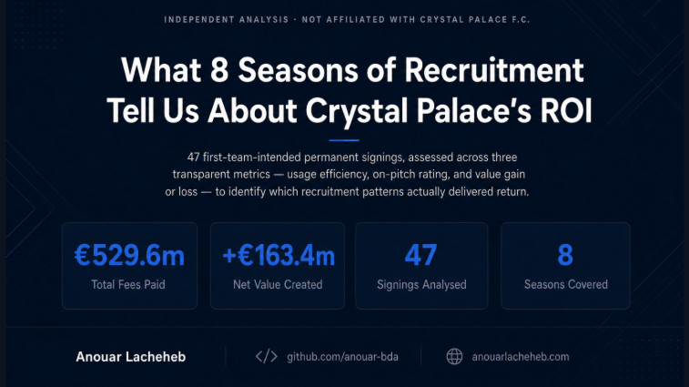
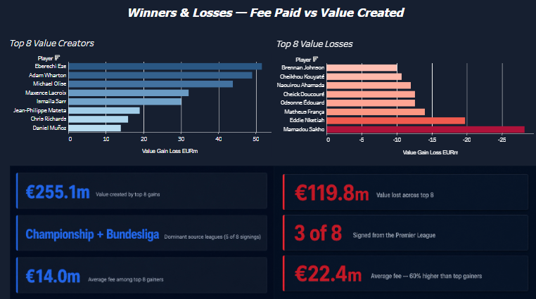
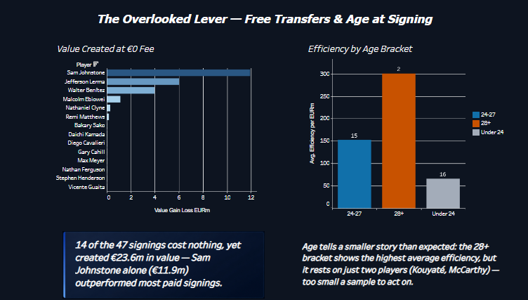
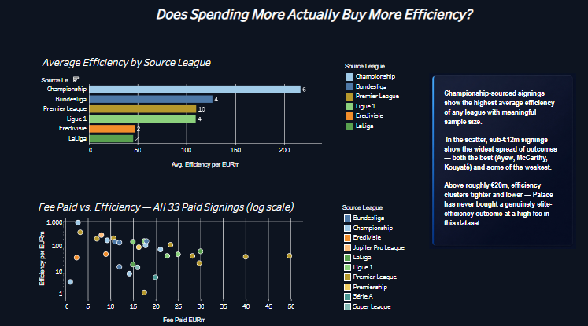
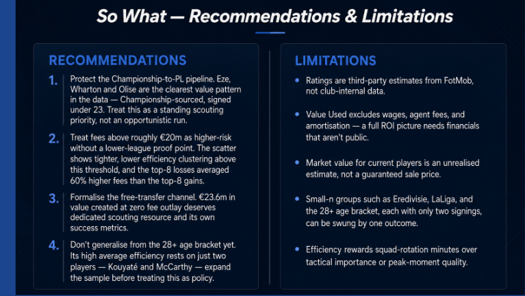

# Crystal Palace — 8-Season Recruitment ROI Analysis
 
**Independent analysis · Not affiliated with, endorsed by, or produced on behalf of Crystal Palace F.C.**
 
An 8-season breakdown of Crystal Palace's permanent recruitment (Aug 2017 – Aug 2025), assessing which signing patterns actually delivered return — and which didn't — across usage efficiency, value gain/loss, and fee-to-outcome relationships.
 
**[View the full interactive Tableau Story →](https://public.tableau.com/views/CrystalPalace8-SeasonRecruitmentROI/CrystalPalace8-SeasonRecruitmentROI?:language=en-US&:sid=&:redirect=auth&:display_count=n&:origin=viz_share_link)**
 

 
---
 
## Business Question
 
Which recruitment patterns have actually returned value for Crystal Palace over the past 8 seasons — and which patterns carry the most risk?
 
Recruitment spend is one of a football club's largest controllable investments outside wages. A Head of Recruitment or Sporting Director weighing the next €20–50m decision needs evidence on what has historically worked, not instinct — and an honest account of what hasn't.
 
---
 
## Data Sources
 
- **Transfermarkt** — transfer fees, market values at signing, current market values, sale fees
- **FotMob** — season-by-season usage (minutes/appearances) and match ratings
All data manually collected and cross-verified, 29 Jul 2026. 47 first-team-intended permanent signings across 8 seasons.
 
### Limitations of the data
- Ratings are third-party estimates, not club-internal figures
- Market value for players still at the club is an unrealised estimate, not a guaranteed sale price
- Fee data does not include add-ons, sell-on clauses, or agent costs
- Small subgroups (e.g. leagues with only 2 signings) can be swung heavily by a single outcome
---
 
## Methodology
 
**Value Used** = sale fee (if sold) → current market value (if still at the club) → €0 (if released free)
 
**Value Gain/Loss** = Value Used − Fee Paid
 
**Efficiency** = usage-per-season (minutes for outfield players, appearances for goalkeepers) per €1m spent — calculated only for paid signings with recorded usage data. Free transfers are analysed separately since dividing by a €0 fee is undefined.
 
### How the Excel workbook was built
 
The workbook has two linked sheets:
 
- **Research Tracker** — one row per player (47 rows), holding the raw inputs I collected manually: fee paid, club signed from, source league, current status, sale fee or current market value, age at signing, etc.
- **FotMob Seasons** — one row per player *per season* (135+ rows), holding usage (minutes/appearances) and match rating for every season they've been at the club, each flagged `Include in Metrics = Yes/No` so injury-hit or non-representative seasons can be excluded without deleting data.
Rather than compute Value Used, Efficiency, and Average Rating by hand, I built them as live formulas in the Research Tracker that pull from the FotMob Seasons sheet:
 
- **Value Used** — a nested `IF` that checks Current Status and returns the sale fee, the current market value, or 0
- **Palace Usage (total)** and **Seasons Played** — `SUMIFS` / `COUNTIFS` against FotMob Seasons, matching on player name and the `Include in Metrics` flag
- **Average FotMob Rating** — `AVERAGEIFS` against the same sheet and flag
- **Usage/Season** and **Efficiency per €1m** — simple division of the above, wrapped in `IFERROR` so free transfers (€0 fee) return blank instead of a division error
Building it this way means the workbook recalculates automatically if I correct a season's data or add a new signing — nothing is hardcoded, and every number in the dashboard can be traced back to a formula and a raw input cell.
 
---
 
## Winners & Losses
 
Top 8 value creators vs. top 8 value losses, ranked by absolute Value Gain/Loss.
 

 
**[View this story point on Tableau Public →](https://public.tableau.com/views/CrystalPalace8-SeasonRecruitmentROI/CrystalPalace8-SeasonRecruitmentROI?:language=en-US&:sid=&:redirect=auth&:display_count=n&:origin=viz_share_link)**
 
- At the top 3, the pattern is narrow: **Eze, Wharton and Olise are all Championship-sourced, all signed under 23**
- Widened to the top 8, **Bundesliga emerges as a second reliable source** (Lacroix, Mateta, Richards — €67m combined value)
- The top 8 losses averaged **€22.4m** per signing — **60% higher** than the average fee among the top 8 gains
---
 
## Free Transfers & Age at Signing
 
The overlooked recruitment channel, plus a look at whether age at signing predicts efficiency.
 

 
**[View this story point on Tableau Public →](https://public.tableau.com/views/CrystalPalace8-SeasonRecruitmentROI/CrystalPalace8-SeasonRecruitmentROI?:language=en-US&:sid=&:redirect=auth&:display_count=n&:origin=viz_share_link)**
 
- **14 of 47 signings cost nothing** and still created **€23.6m** in value — a channel that gets little formal analytical attention
- The 28+ age bracket shows the highest average efficiency, but rests on just 2 players (Kouyaté, McCarthy) — too small a sample to generalise from
---
 
## Recruitment Patterns
 
Efficiency by source league, and fee vs. efficiency on a log-scaled scatter (linear scale would compress most signings beneath a handful of extreme outliers).
 

 
**[View this story point on Tableau Public →](https://public.tableau.com/views/CrystalPalace8-SeasonRecruitmentROI/CrystalPalace8-SeasonRecruitmentROI?:language=en-US&:sid=&:redirect=auth&:display_count=n&:origin=viz_share_link)**
 
- Championship-sourced signings show the highest average efficiency of any league with a meaningful sample size
- **€529.6m** spent across 47 signings; **+€163.4m** net value created overall
- On the log-scaled view, **outcomes above ~€20m cluster tighter and lower** than sub-€12m signings — Palace has not yet bought a genuinely elite-efficiency outcome at a high fee in this dataset
---
 
## Recommendations & Limitations
 

 
**[View this story point on Tableau Public →](https://public.tableau.com/views/CrystalPalace8-SeasonRecruitmentROI/CrystalPalace8-SeasonRecruitmentROI?:language=en-US&:sid=&:redirect=auth&:display_count=n&:origin=viz_share_link)**
 
### Recommendations
1. **Protect the Championship-to-PL pipeline** as a standing scouting priority, not an opportunistic pattern
2. **Treat fees above ~€20m as higher-risk** without a lower-league proof point
3. **Formalise the free-transfer channel** with its own scouting resource and success metrics
4. **Don't generalise from the 28+ age bracket yet** — expand the sample before treating it as policy
### Limitations
- Ratings are third-party estimates (FotMob), not club-internal data
- Value Used excludes wages, agent fees, and amortisation — a full ROI picture would need financials that aren't public
- Market value for current players is unrealised, not a guaranteed sale price
- Small-n groups (Eredivisie n=2, LaLiga n=2, 28+ age bracket n=2) can be swung by one outcome
- Efficiency rewards squad-rotation minutes over tactical importance or peak-moment quality
---
 
## Future Improvements
 
- Expand the 28+ age bracket sample using more historical signings for a fairer read on age-at-signing effects
- Incorporate wage data if a reliable public source becomes available, to move toward a fuller ROI picture
- Extend the free-transfer analysis into its own standalone breakdown
- Add a season-by-season trend view to see whether recruitment patterns have shifted under different transfer windows
---
 
## Tools Used
 
- **Excel** — data collection, cleaning, and formula-driven calculation (SUMIFS, COUNTIFS, AVERAGEIFS)
- **Tableau Public** — dashboard and story build
---
 
## Repository Structure
 
```
crystal-palace-recruitment-roi/
├── data/
│   └── crystal_palace_tableau_extract.csv
├── workbook/
│   └── crystal_palace_47_players_FORMULAS.xlsx
├── screenshots/
│   ├── overview.png
│   ├── winners_and_losses.png
│   ├── free_transfers_and_age.png
│   ├── recruitment_patterns.png
│   └── recommendations.png
└── README.md
```
 
---
 
## Contact
 
**Anouar Lacheheb**<br>
Website Portfolio: anouarlacheheb.com<br>
GitHub: github.com/anouar-bda<br>
LinkedIn: linkedin.com/in/anouar-lacheheb-328052398
